# Liquidity Flow Controller

- `validator.py` keeps the validator’s on-chain weights pointed at a single chosen miner so that all voting power flows there.
- `miner.py` collects alpha on the miner-owned hotkey, moves it onto the RT21 validator hotkey, and then sweeps the RT21 balance to the treasury coldkey each epoch.

## Flow of Stake Funds

1. **Validator weight burn**  
   - On each loop it confirms the validator hotkey is registered and holds a permit.  
   - It then sets weights so that 100% of your validator emission is routed to target UID (auto-detected owner wallet for burn or supplied through `--target_uid`).

2. **Miner emissions accumulation**  
   - Validator weights cause the subnet’s validator emissions to concentrate on a miner-owned hotkey.  
   - `miner.py` runs under the wallet that controls both that miner hotkey and the RT21 validator hotkey (`5CATQqY6rA26Kkvm2abMTRtxnwyxigHZKxNJq86bUcpYsn35` by default).  
   - Each epoch it first moves all alpha earned on the miner’s hotkey into the RT21 hotkey so the stake immediately earns RT21 rewards.

3. **Epoch-based forwarding**  
   - The script watches for epoch boundaries using `get_next_epoch_start_block` (or tempo-based fallback).  
   - After consolidating the epoch’s rewards into RT21, it transfers the entire RT21 balance to the destination coldkey (`5HLBDbdKfPCPKW33sPPyut8dPRTXA413Yp4ZRBgVKfrk4PcD` by default) via `subtensor.transfer_stake(..., amount=stake)`.  
   - This keeps the miner hotkey empty, parks stake on RT21 just long enough to accrue rewards, and then sweeps everything into the treasury wallet.

The diagram below summarises the cycle:

```mermaid
%%{init: {'flowchart': {'defaultRenderer': 'elk', 'nodeSpacing': 40, 'rankSpacing': 60}}}%%
flowchart LR
    V(["🛡️ Validator weights"]) -->|100% weight| H(["⚒️ Miner hotkey"])
    H -->|miner.py move| R(["🏛️ RT21 validator hotkey"])
    V -.->|emission direction| H
    R -->|epoch transfer| C(["💰 Destination coldkey"])

    classDef validator fill:#1f77b4,color:#ffffff,stroke:#0d3d63,stroke-width:2px;
    classDef miner fill:#2ca02c,color:#ffffff,stroke:#1c5f1c,stroke-width:2px;
    classDef rt21 fill:#9467bd,color:#ffffff,stroke:#4b2a86,stroke-width:2px;
    classDef treasury fill:#ff7f0e,color:#ffffff,stroke:#b35500,stroke-width:2px;

    class V validator;
    class H miner;
    class R rt21;
    class C treasury;
```



## Running the Components

### Validator loop

**Basic usage:**
```bash
python neuron/validator.py run \
  --netuid 35 \
  --wallet.name <wallet-name> \
  --wallet.hotkey <hotkey-name> \
  --target_uid <optional-uid> \
  --logging.debug
```

**With Slack notifications:**
```bash
python neuron/validator.py run \
  --netuid 35 \
  --wallet.name <wallet-name> \
  --wallet.hotkey <hotkey-name> \
  --slack_webhook_url "https://hooks.slack.com/services/YOUR/WEBHOOK/URL" \
  --logging.debug
```

**With local subtensor:**
```bash
python neuron/validator.py run \
  --netuid 35 \
  --wallet.name <wallet-name> \
  --wallet.hotkey <hotkey-name> \
  --subtensor.network local \
  --subtensor.chain_endpoint ws://127.0.0.1:9946 \
  --logging.debug
```

Key flags:

- `--netuid` (required): subnet to validate on.
- `--target_uid`: override the auto-selected burn UID.
- `--set_weights_interval`: number of blocks between weight updates (default two epochs = 720 blocks). The validator respects this interval and will wait the full duration if weights are set too soon. At ~12 seconds per block, 720 blocks = ~2.4 hours.
- `--slack_webhook_url`: Slack webhook URL for notifications (alerts for registration failures, no permit events, weight setting errors/successes, and daily summaries).
- `--subtensor.network`: network to connect to (`finney`, `test`, or `local`).
- `--subtensor.chain_endpoint`: custom chain endpoint (e.g., `ws://127.0.0.1:9946` for local subtensor).
- `--logging.debug` / `--logging.trace`: enable progressively more verbose Bittensor logging for full visibility into each validator action.
  - Logging defaults to INFO if no flag is provided.

### Miner sweeper

```bash
python neuron/miner.py \
  --netuid 35 \
  --wallet.name <wallet-name> \
  --wallet.hotkey <hotkey-name> \
  --logging.debug
```

Key flags:

- `--aggregator-hotkey`: the RT21 validator hotkey that temporarily holds stake before the treasury sweep (ensure it is controlled by the same coldkey so stake moves succeed).
- `--destination-coldkey`: coldkey receiving the stake each epoch.
- `--poll-interval`: how often (in seconds) to check for epoch boundaries.
- `--wait-finalization`: wait for block finalization (default waits for inclusion only).
- `--no-initial-transfer`: skip the first immediate transfer if you only want epoch-based moves.
- `--logging.debug` / `--logging.trace`: enable progressively more verbose Bittensor logging for end-to-end visibility (defaults to INFO when omitted).

Both scripts reuse wallet/subtensor argument helpers from the shared `config.py`.

### Mock Flow Test

To exercise the validator and miner logic without touching a real Bittensor node, run the mock test:

```bash
python -m unittest tests.mock_flow_test
```

The mock harness stubs the wallet and subtensor interfaces to verify that weight-setting, stake sweeps, and transfers occur as expected.

## Operational Notes

- Ensure the aggregator hotkey belongs to the same coldkey that runs the miner script; otherwise stake moves will fail.
- Unlock prompts come from the Bittensor SDK. The scripts abort if coldkey passwords are incorrect or keyfiles are missing.
- Consider running `miner.py` under a supervisor (systemd, tmux, etc.) so it remains active between reboots.
