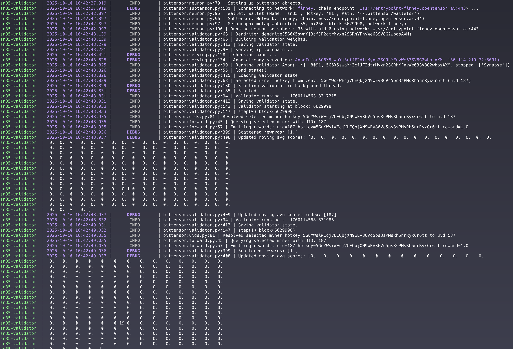
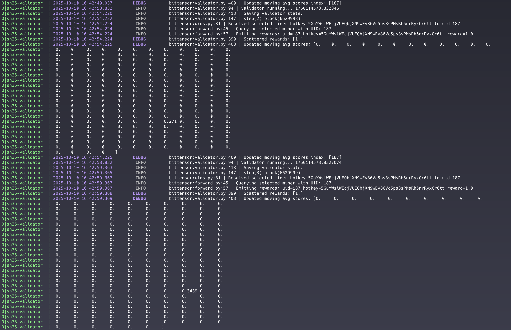
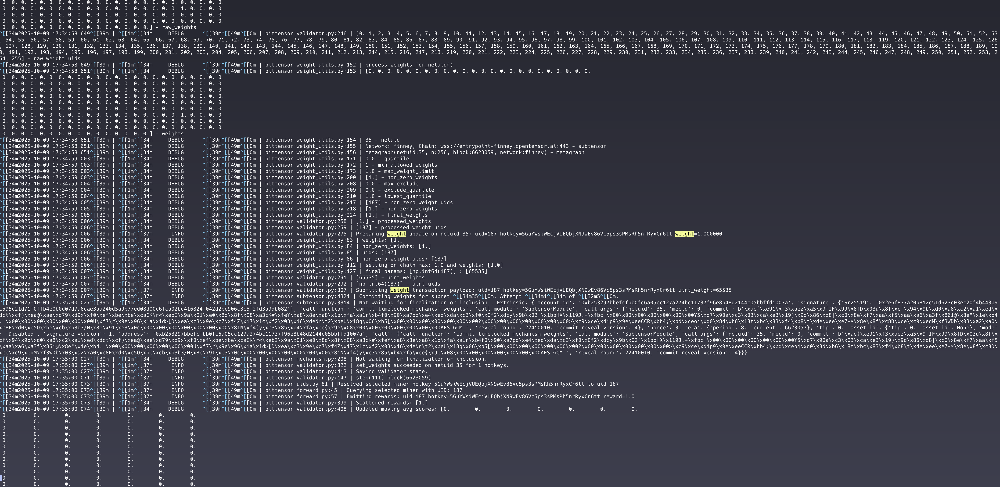

# Test Evidence

Snapshots collected while running the validator after updating the epoch length to `360` blocks.
The screenshots document:

- Continuous validation cycles scoring the target miner.
- A successful post-epoch weight emission reflecting the new timing.

## 1. Validator Loop (`validator-run-1.png`)

- Captured during normal operation shortly after startup.
- Shows the validator stepping through the loop, saving state, resolving the selected hotkey (`uid 187`), emitting rewards of `1.0`, and updating the moving-average scores.
- Confirms that reward propagation and score maintenance continue to function after the configuration change.

## 2. Ongoing Validation (`validator-run-2.png`)

- Later snapshot from the same run, demonstrating consistent reward emissions and score updates.
- Highlights that the validator maintains its moving-average scores while continually querying the configured miner.

## 3. Weight Transaction (`validator-setting-weights-1.png`)

- Recorded once the 360-block window elapsed.
- Logs from `weight_utils` display processed weight uids, final processed weights, and conversion to uint payload prior to submission.
- Includes the `subtensor.set_weights` call outcome, demonstrating that weights were successfully pushed on-chain with `weight=1.000000` for `uid 187`.
