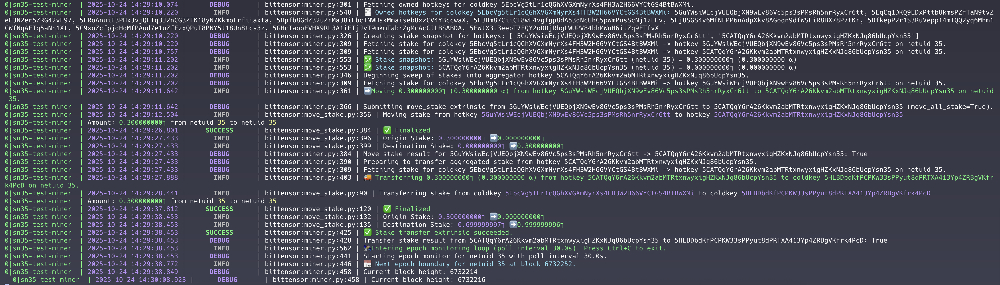
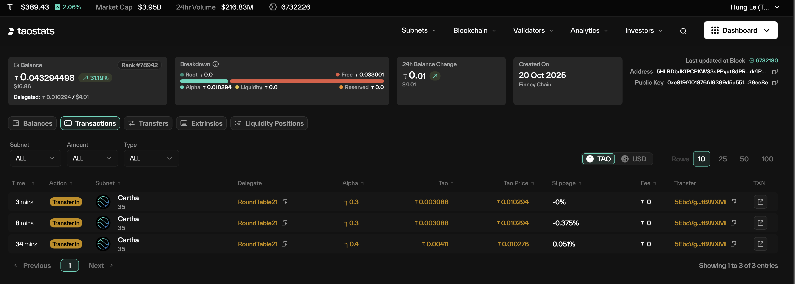

# Miner Flow Evidence

This directory captures the end-to-end behaviour of the liquidity flow miner after the recent hotkey-focused update.

## Flow Overview

1. **Stake discovery** – the miner snapshots stake only for the active running hotkey and the RT21 aggregator hotkey.  
2. **Sweep** – any alpha that accumulates on the running hotkey is moved wholesale to the RT21 aggregator.  
3. **Transfer** – once the sweep completes, the RT21 hotkey forwards the aggregated stake to the multi-sig treasury coldkey.  
4. **Loop** – the cycle repeats at every epoch boundary according to the configured poll interval.

## CLI Evidence

- The script fetches stake for the running hotkey and the RT21 Validator hotkey `5CATQqY6rA26Kkvm2abMTRtxnwyxigHZKxNJq86bUcpYsn35` hotkey.  
- A `move_stake` extrinsic transfers 0.3 α from the running hotkey to the RT21 hotkey.  
- A `transfer_stake` extrinsic passes the same 0.3 α from RT21 to the destination multisig coldkey `5HLBDbdKfPCPKW33sPPyut8dPRTXA413Yp4ZRBqVKfrk4PcD`.  
- The miner immediately re-enters the monitoring loop, awaiting the next epoch.

## On-chain Confirmation

The TaoStats dashboard for the target multi-sig shows consecutive “Transfer In” events from delegate **RoundTable21**, each recording 0.3 α hitting the coldkey. This mirrors the values emitted in the miner log, proving that the sweep-and-forward logic executed successfully on chain.

Together, the CLI trace and TaoStats view confirm the miner is:

- Tracking only the intended running hotkey.  
- Moving all earned stake into the RT21 aggregator at the epoch boundary.  
- Settling the funds into the target multi-sig coldkey every cycle.
